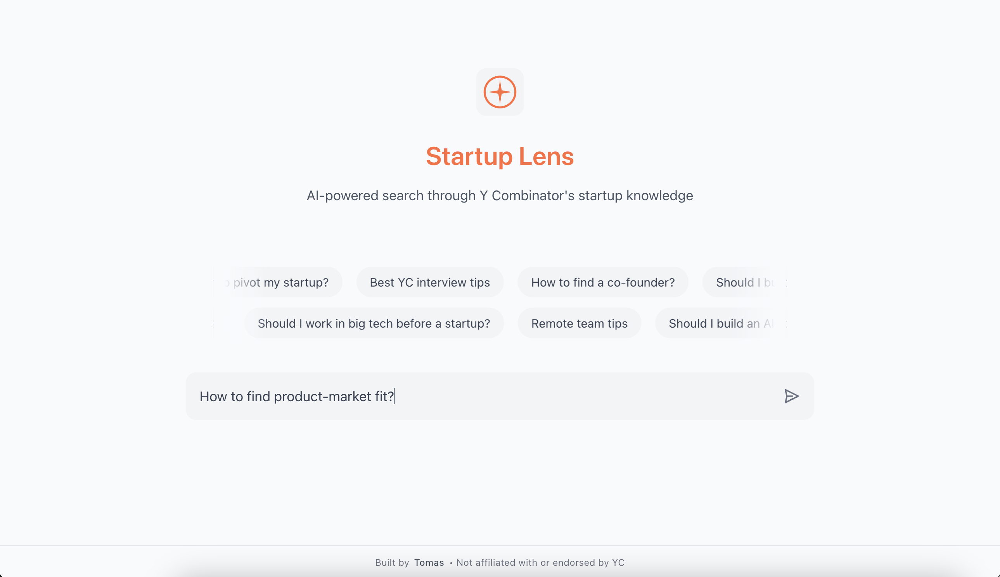

# &nbsp;&nbsp;StartupLens - Video search for startup knowledge 🎥



## 📖 Overview

StartupLens makes Y Combinator's vast video knowledge base searchable at a granular level. By processing over 500 YC videos, the platform can point you to the exact moment in a video that answers your question. No more scrubbing through hour-long videos - just ask your question and get taken directly to the relevant clip.

## ✨ Key Features

- 🎯 **Precise Video Clips**: Get the exact moments in videos that answer your question, not entire videos
- 📚 **Rich Knowledge Base**: Search across 500+ Y Combinator startup videos
- 🔍 **Smart Search**: Natural language search powered by vector similarity and Cohere's reranking
- 💡 **Instant Follow-up**: Each clip comes with relevant follow-up questions to dive deeper
- 🔗 **Easy Sharing**: Share specific video clips by copying a generated link or through native sharing

## 🛠️ Technical Architecture

### 🧩 RAG System Implementation

The core of StartupLens uses Retrieval Augmented Generation (RAG) to find the most relevant video clips:

1. **Video Processing Pipeline**
   - YC videos are transcribed and segmented into small chunks
   - Each chunk maintains its video source and timestamp information
   - Chunks are embedded into vectors using AI models
   - Vectors and metadata are stored in Pinecone

2. **Search and Retrieval**
   - User questions are converted to vectors
   - Pinecone finds similar video segments
   - Cohere reranks results for relevance
   - System returns exact video timestamps

3. **Result Presentation**
   - Users see a list of relevant video clips
   - Each result links to the exact timestamp
   - Clips are ordered by relevance
   - Original context is preserved

### Data Flow

```
[YC Videos] → [Transcription] → [Chunking] → [Vector Embedding] → [Pinecone Storage]
                                                                         ↓
[User Query] → [Vector Embedding] → [Pinecone Search] → [Cohere Rerank] → [Clip Results]
```

## 💻 Technologies Used

- Next.js for the frontend
- Node.js and Express for the backend
- Pinecone for vector storage and similarity search
- Cohere for reranking results
- TypeScript

## ⚙️ Local Development Setup

### 📋 Prerequisites

- Node.js (v18 or higher)
- npm
- Set up environment variables

### Frontend Setup

1. Navigate to the frontend directory:
```bash
cd frontend
```

2. Install dependencies:
```bash
npm install
```

3. Run the development server:
```bash
npm run dev
```

The frontend will be available at [http://localhost:3000](http://localhost:3000)

### Backend Setup

1. Navigate to the backend directory:
```bash
cd backend
```

2. Install dependencies:
```bash
npm install
```

3. Run the development server:
```bash
npm run dev
```

The backend API will be available at [http://localhost:3001](http://localhost:3001)

NOTE: the backend makes requests to a Pinecone index named 'yc-search-engine', which contains the embeddings of every video chunk. You must set up your own Pinecone index with this name in order to make successful calls through your local app. 

### Configuration 

#### Frontend Configuration
Create a `.env.local` file in the frontend directory with the following variables:
```env
NEXT_PUBLIC_API_URL=http://localhost:3001
```

### Backend Configuration
Create a `.env` file in the backend directory with the following variables:
```env
PORT=3001
PINECONE_API_KEY=your_pinecone_api_key
OPENAI_API_KEY=your_openai_api_key
COHERE_API_KEY=your_cohere_api_key 
ANTHROPIC_API_KEY=your_anthropic_api_key
```

## 📄 License 

MIT
